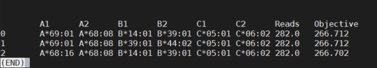

### Worked from lab starting ~7:30am

## Table of contents

### TJ
I helped TJ get into lab and get settled with a place to work and a tour. We checked and he completed the safety course, but still doesn't have access.
Even checking the EHS integrator, he is listed as a person that should have access, but doesn't. Emailing EHS was unhelpful as they said they don't do 
direct requests for access and it had to be someone from the department. 

### Attended CES
We met from 9:45 til 11. I checked out GEPIA, the expression tool. It's nice, but only for TCGA/GTEx data.
`http://gepia.cancer-pku.cn/`
If the project uses other data, it is unlikely to be all that helpful.

### Keratin
The alignment the Mihn's group sent is not v. good. I decided to realign myself. They emailed pressing for results, made sure to assure them that even Wang's small analysis took 3 days to finish running and that it takes time. 
I build MrBayes from source and tested it so I can run that way when the time comes

## Immuno-effect

### Check aln and filter reads
I checked the results of the bwa from the last time I worked on the project. They completed as expected.
I then filtered out all the unmapped reads from the data using samtools
`samtools view -h -F 4 hla_YLR002P2.sam > hla_YLR002P2_mapped.sam`

I wanted to see how many reads mapped so I did some quick counts.
`samtools view -c hla_YLR002P2.sam`

> 153199423

`samtools view -c hla_YLR002P2_mapped.sam`

> 3900

So a rather small fraction mapped to HLA, which is to be expected!

### Lets get the HLA typing

`singularity run ~/optitype/optitype_latest.sif --input hla_YLR002P2_mapped.sam --dna --enumerate 3 --verbose --outdir ~/testLungImmuno/`

I am using three enumerated results, because it will let us see what 'near' HLA typings there are. For YLR002P2, for instance...

Table: 

### Now need to convert sam to fasta for netMHCpan4.1
Ran as sbatch script, due to size and time.

`module load Java`
`module load picard`
`java -jar $EBROOTPICARD/picard.jar SamToFastq -I ~/scratch60/YLR002P2_collated.bam -FASTQ ~/scratch60/hla_YLR002P2-pair1.fastq -F2 ~/scratch60/hla_YLR002P2-pair2.fastq`

# NOTE: Suspect why workflow works on some fails on others
According to the pVACSeq documentation (not directly relevant to netMHCpan but matters), the programs are limited by:

> "algorithm-specific subset of HLA alleles, so we are constrained to the set of NetMHC-compatible alleles. The current version NetMHC v3.4 supports 78 human alleles."

